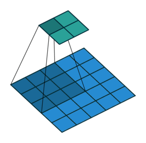
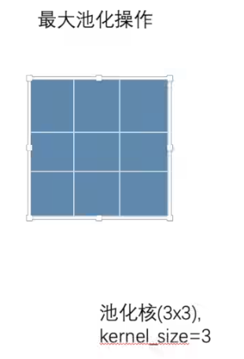
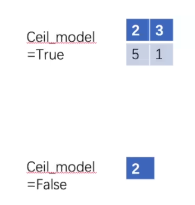
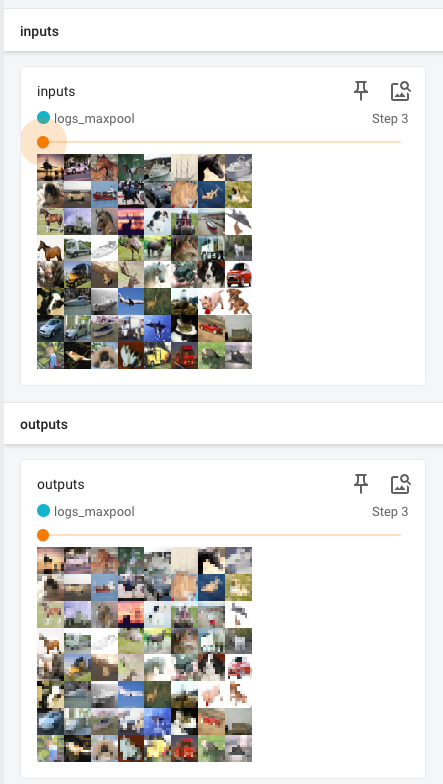

PyTorch Learning Demo

## 一、参考课程

[Pytorch深度学习快速入门](https://www.bilibili.com/video/BV1hE411t7RN/?spm_id_from=333.337.search-card.all.click&vd_source=43478a57ace1753f8a10a9b342b5e5b6)

## 二、环境配置

### 1.anaconda介绍

Anaconda 是一个开源的 Python 发行版，主要有以下作用：

**一、方便的环境管理**

1. 多环境隔离
   - 允许用户创建多个独立的 Python 环境，每个环境可以有不同的 Python 版本以及不同的第三方库和依赖项。这对于同时处理多个不同项目非常有用，避免了不同项目之间的库冲突问题。
   - 例如，一个项目可能需要使用 Python 2.7 和特定版本的库，而另一个项目需要 Python 3.8 和另一组库，Anaconda 可以轻松为这两个项目创建独立的环境，确保它们可以独立运行而不互相干扰。
2. 环境快速创建和切换
   - 可以快速创建新的环境并安装所需的库。用户只需指定所需的 Python 版本和一些关键的库，Anaconda 就会自动下载并安装这些依赖项，大大节省了环境搭建的时间。
   - 切换环境也很方便，通过简单的命令就可以在不同的环境之间切换，方便开发人员在不同项目之间快速切换工作环境。

**二、丰富的包管理**

1. 大量预装库
   - Anaconda 预装了许多常用的科学计算、数据分析和机器学习库，如 NumPy、Pandas、Matplotlib、Scikit-learn 等。这使得用户在开始一个新的数据分析或机器学习项目时，无需手动安装这些基础库，可以直接开始编码。
   - 对于初学者来说，这减少了安装和配置的复杂性，让他们能够更快地进入实际的编程和数据分析工作。
2. 便捷的包安装和更新
   - 使用 Anaconda 的包管理工具 conda，可以方便地安装、更新和卸载各种 Python 包。conda 不仅可以管理 Python 包，还可以安装一些非 - Python 的软件和工具，这些软件和工具通常在数据科学和科学计算中会用到。
   - 例如，可以使用 conda 安装 R 语言、Jupyter Notebook 扩展、数据库驱动程序等。conda 还支持从不同的渠道安装包，包括 Anaconda 官方仓库、第三方仓库和本地安装包。

**三、集成开发工具**

1. Jupyter Notebook 支持
   - Anaconda 集成了 Jupyter Notebook，这是一个非常流行的交互式编程环境，特别适合数据分析、机器学习和教学。Jupyter Notebook 允许用户在浏览器中创建和分享包含代码、文本、图像、公式等的文档，方便进行数据分析的探索、可视化和结果展示。
   - Anaconda 使得启动 Jupyter Notebook 变得非常容易，并且可以在不同的环境中使用不同版本的 Python 和库来运行 Notebook，满足各种项目的需求。
2. 其他开发工具集成
   - 除了 Jupyter Notebook，Anaconda 还可以集成其他开发工具，如 Spyder（一个功能强大的 Python 集成开发环境）、VS Code（通过安装 Anaconda 扩展）等。这些工具提供了更丰富的开发功能，如代码编辑、调试、版本控制等，提高了开发效率。

### 2.anaconda安装

**下载地址：**[anaconda官网](https://anaconda.org/)

进入官网，点击download anaconda


这一步可以用自己的邮箱注册账号，也可以点击skip直接跳过


到这里就可以选择合适的版本进行下载，这里我是M2芯片的mac，所以选择`Download for Apple Silicon`


下载完成以后就可以点击安装包进行安装

打开终端输入下面的命令：

```
conda list
```

下面的情况即是安装成功


### 3.虚拟环境配置

在 Anaconda 中创建虚拟环境可以通过以下步骤进行：

**一、使用命令行创建虚拟环境**

1. 打开终端（Terminal）应用程序。
2. 使用 `conda create` 命令创建虚拟环境。以下是一些常用的参数和示例：
   - 创建一个名为 `pytorch` 的虚拟环境，并指定 Python 版本为 3.8：

```plaintext
     conda create -n pytorch python=3.8
```


3. 按下回车键后，Anaconda 会显示将要安装的包和所需的空间等信息，并询问你是否继续。输入 `y` 并按下回车键以继续安装。


**二、使用 Anaconda Navigator 创建虚拟环境**

1. 打开 Anaconda Navigator。它通常可以在应用程序文件夹中找到，或者通过在终端中输入 `anaconda-navigator` 来启动。
2. 在 Anaconda Navigator 的主界面中，点击左侧菜单栏中的 “Environments”（环境）选项。
3. 在 “Environments” 页面中，点击右上角的 “Create”（创建）按钮。
4. 在弹出的窗口中，为虚拟环境输入一个名称（例如 `myenv`），选择一个 Python 版本（如果需要特定版本），然后点击 “Create” 按钮。

**三、激活和使用虚拟环境**

1. 命令行激活：
   - 在终端中，输入以下命令来激活创建的虚拟环境（以 `pytorch` 为例）：

```plaintext
     conda activate pytorch
```

- 激活后，终端提示符前面会显示虚拟环境的名称（例如 `(myenv)`）。
- 现在我们尝试激活之前创建的环境，从最左边的括号里的内容就可以看到，我们的环境从base切到了新建的pytorch


1. 在 Anaconda Navigator 中激活：
   - 在 Anaconda Navigator 的 “Environments” 页面中，找到并选择要激活的虚拟环境，然后点击右侧的 “Play” 按钮，选择 “Open Terminal”（打开终端），这将打开一个已经激活了该虚拟环境的终端窗口。

现在你可以在激活的虚拟环境中安装、使用和管理特定的包，而不会影响其他环境或系统的全局 Python 安装。当你完成在虚拟环境中的工作后，可以使用 `conda deactivate` 命令来退出虚拟环境。

### 4.安装Pytorch

网站地址：[Pytorch官网](https://pytorch.org/)


由于这里要求使用python3.9以上的版本，我们删除前面安装的环境，重新配置一个：

先切回base环境：

```
conda activate base
```

删除环境:

```
conda remove --name pytorch --all
```


改为使用python3.9:


最后，我们根据官网提供的安装指令，去安装pytorch，这里我选择用conda去安装：


由于我使用的是M2芯片的笔记本，不支持CUDA，但是pytorch有做支持，所以直接选择Default即可


检查是否安装成功：

如果是windows笔记本，可以通过下面的指令检测是否安装成功，cuda是否支持


如果是M芯片的Mac笔记本，可以通过下面的命令检测是否支持GPU。如果这两个输出都为`True`，则表示 Mac 的 MPS 可用，可以在 PyTorch 中使用 GPU 加速计算。

```python
import torch
print(torch.backends.mps.is_available())
print(torch.backends.mps.is_built())
```

### 5.pycharm中使用对应的环境

用pycharm新建工程时，使用anaconda3新建


已有的工程也可以在设置/项目/解释器中更改，当前的anaconda会默认是base环境，如果要改成我们之前创建的pytorch环境，就需要

点击添加解释器/添加本地解释器


然后最左边切到Conda环境，单选使用现有环境，点击下拉框就可以使用我们之前创建好的环境


## 三、两大工具函数

### 1.`dir`

在 Python 中，`dir()` 函数是一个非常有用的内置函数。

**一、作用**

`dir()` 函数用于返回一个对象的所有属性和方法的列表（包括从父类继承来的属性和方法）。如果没有传入参数，它会返回当前作用域中的名称列表。

**二、用法示例**

1. 对模块使用：

```python
   import math
   print(dir(math))
```

这将列出 `math` 模块中的所有属性和方法，比如 `pi`、`sin`、`cos` 等。

1. 对类使用：

```python
   class MyClass:
       def __init__(self):
           self.x = 10
       def my_method(self):
           pass

   obj = MyClass()
   print(dir(obj))
```

这会列出 `MyClass` 实例对象的属性和方法，包括从 `object` 类继承来的方法，如 `__init__`、`__str__` 等，以及自定义的属性 `x` 和方法 `my_method`。

1. 没有参数时：

```python
   def my_function():
       pass

   print(dir())
```

如果在这个函数所在的作用域中调用 `dir()`，它会列出当前作用域中的名称，比如可能包括内置函数名、已导入的模块名、自定义的函数名等。

**三、用途**

1. 探索对象的功能：当你使用一个不熟悉的对象时，可以通过 `dir()` 快速了解它提供了哪些属性和方法。
2. 调试和开发：在调试过程中，可以检查对象是否具有特定的属性或方法，以帮助确定问题所在。
3. 动态编程：可以根据对象的属性和方法动态地调用它们，实现更加灵活的编程。

### 2.`help`

在 Python 中，`help()` 函数是一个用于获取帮助信息的内置函数。

**一、作用**

调用 `help()` 函数可以显示对象的文档字符串（如果有）以及关于该对象的一些帮助信息，包括对象的属性和方法的描述。

**二、用法示例**

1. 对模块使用：

```python
   import math
   help(math)
```

这将显示 `math` 模块的帮助信息，包括模块的文档字符串（如果有）以及模块中定义的函数和常量的描述。

1. 对函数使用：

```python
   def my_function():
       """This is a custom function."""
       pass

   help(my_function)
```

会显示关于 `my_function` 的帮助信息，包括函数的文档字符串。

1. 对类使用：

```python
   class MyClass:
       """This is a custom class."""
       def __init__(self):
           pass

   help(MyClass)
```

显示 `MyClass` 类的帮助信息，包括类的文档字符串以及类的方法的描述。

1. 对方法使用：

```python
   class MyClass:
       def my_method(self):
           """This is a custom method."""
           pass

   obj = MyClass()
   help(obj.my_method)
```

显示 `my_method` 方法的帮助信息。

**三、用途**

1. 学习新的模块、函数、类或方法：当你遇到一个不熟悉的 Python 内置模块或第三方库时，使用 `help()` 可以快速了解其功能和用法。
2. 查看文档字符串：可以方便地查看开发者为函数、类等编写的文档说明，以便更好地理解代码的意图和使用方式。
3. 调试和理解代码：在调试过程中，通过查看帮助信息可以更好地理解代码的行为和各个部分的作用。

## 四、Pytorch如何加载数据

### 1.`pytorch`中的`DataSet`类与`DataLoader`类

#### 1.1 Dataset类

在 PyTorch 中，`Dataset` 类是一个抽象类，用于表示数据集。它的主要目的是为数据加载提供一个统一的接口，使得数据可以方便地被模型使用。

以下是关于 `Dataset` 类的一些重要特点和用法：

1. `__init__()`：初始化方法，通常用于设置数据集的路径、预处理参数等。
2. `__len__()`：必须实现的方法，返回数据集的大小，即数据集中样本的数量。
3. `__getitem__()`：必须实现的方法，接受一个索引作为参数，返回数据集中对应索引的样本。

#### 1.2 DataLoader类

在 PyTorch 中，`DataLoader` 是一个用于数据加载的实用工具类。它可以将数据集（通常是一个实现了 `Dataset` 类的对象）包装起来，提供高效的数据加载和批处理功能。

1. `dataset`：这是一个必须的参数，是一个实现了 `Dataset` 类的对象，表示要加载的数据。
2. `batch_size`：指定每个批次的大小。例如，如果 `batch_size=32`，则每次从数据集中取出 32 个样本组成一个批次。
3. `shuffle`：如果设置为 `True`，在每个 epoch 开始时会随机打乱数据的顺序。这有助于提高模型的泛化能力。
4. `num_workers`：指定用于数据加载的子进程数量。增加这个值可以提高数据加载的速度，但也会消耗更多的系统资源。
5. `drop_last`：如果数据集的大小不能被 `batch_size` 整除，当设置为 `True` 时，会丢弃最后一个不完整的批次。

#### 1.3 使用示例

```python
import torch
from torch.utils.data import Dataset, DataLoader

class CustomDataset(Dataset):
    def __init__(self, data):
        self.data = data

    def __len__(self):
        return len(self.data)

    def __getitem__(self, index):
        return self.data[index]

data = [1, 2, 3, 4, 5, 6, 7, 8]
dataset = CustomDataset(data)
dataloader = DataLoader(dataset, batch_size=3, shuffle=True, num_workers=2)

for batch in dataloader:
    print(batch)
```

#### 1.4 作用和优势

1. 高效数据加载：`DataLoader` 使用多进程（如果 `num_workers` 大于 0）来并行加载数据，从而加快数据加载速度，特别是对于大型数据集。
2. 批处理：自动将数据分成批次，方便模型进行批量处理。这对于需要批量输入的深度学习模型非常重要。
3. 数据打乱：通过设置 `shuffle=True`，可以在每个 epoch 中随机打乱数据的顺序，有助于模型更好地学习数据的分布，提高泛化能力。
4. 灵活性：可以方便地调整各种参数，如批次大小、数据加载的并行度等，以适应不同的数据集和模型需求。

### 2.蚂蚁蜜蜂分类数据集

#### 2.1 数据集下载链接

[下载链接](https://download.pytorch.org/tutorial/hymenoptera_data.zip)

#### 2.2 结构讲解


### 3.使用Dataset和DataLoader加载数据集

#### 3.1 基于Dataset抽象类实现一个数据集类

```python
class myDataSet(Dataset):
    def __init__(self, root_dir, label_dir):
        self.root_dir = root_dir # 数据集根地址
        self.label_dir = label_dir # 数据集标签地址 ants or bees
        self.path = os.path.join(root_dir, label_dir) # 数据集图片地址，用根目录和标签目录拼接
        self.img_dir = os.listdir(self.path)
    def __getitem__(self, index):
        img_name = self.img_dir[index]
        img_item_path = os.path.join(self.root_dir, self.label_dir, img_name)
        img = Image.open(img_item_path)
        label = self.label_dir
        return img, label
    def __len__(self):
        return len(self.img_dir)
```

#### 3.2 创建数据集

```python
root_dir = '../hymenoptera_data/train'
ants_label_dir = 'ants'
bees_label_dir = 'bees'
ants_dataSet = myDataSet(root_dir, ants_label_dir)
bees_dataSet = myDataSet(root_dir, bees_label_dir)
# ants_dataSet.__getitem__(0)[0].show() # 展示蚂蚁数据集的第一张图片
# 拼接数据集为训练集
train_dataSet = ants_dataSet + bees_dataSet
print(train_dataSet.__getitem__(0))
```

#### 3.3 用DataLoader进行装载

```python
train_dataLoader = DataLoader(train_dataSet, shuffle=True)
print(train_dataLoader)
for batch in train_dataSet:
    print(batch) # (<PIL.JpegImagePlugin.JpegImageFile image mode=RGB size=500x375 at 0x12D0E6AF0>, 'ants')
```

## 五、TensorBoard

### 1.简介

TensorBoard 是一个用于可视化和分析 TensorFlow 运行过程和结果的工具。它可以帮助你更好地理解、调试和优化机器学习模型。

### 2.安装

PyTorch 本身并不自带 TensorBoard。

但是，可以通过安装 `torch.utils.tensorboard` 模块来在 PyTorch 中使用 TensorBoard。

**安装指令**：

```
pip install tensorboard
```

**导入**：

```python
from torch.utils.tensorboard import SummaryWriter
```

### 3.`SummaryWriter`的使用方法

**一、导入模块并创建`SummaryWriter`对象**

```python
from torch.utils.tensorboard import SummaryWriter

writer = SummaryWriter(log_dir='runs/experiment_name')
```

这里的`log_dir`参数指定了保存事件文件的目录路径。可以根据不同的实验设置不同的目录名称。

**二、在训练过程中记录数据**

1. **标量数据（Scalars）**：

   可以记录训练过程中的损失、准确率等标量指标。

   以下是`add_scalar`方法的详细用法：

   ```python
   add_scalar(tag, scalar_value, global_step=None, walltime=None)
   ```

   - `tag`：字符串类型，表示数据的名称标签。这个标签将在 TensorBoard 中用于区分不同的数据系列。例如，可以使用`'loss'`表示损失值，`'accuracy'`表示准确率等。
   - `scalar_value`：要记录的标量值，可以是整数、浮点数等数值类型。
   - `global_step`：可选参数，通常是一个整数，表示当前的训练步数、迭代次数或 epoch 数等。这个参数用于在横坐标上显示数据的位置。如果不提供这个参数，数据将在 TensorBoard 中以无顺序的方式显示。
   - `walltime`：可选参数，通常是一个浮点数，表示记录数据的时间戳。如果不提供这个参数，将使用当前时间。

   以下是一个示例用法：

   ```python
   from torch.utils.tensorboard import SummaryWriter
   
   writer = SummaryWriter('runs/experiment')
   
   for epoch in range(10):
       loss = epoch * 0.1
       writer.add_scalar('training_loss', loss, epoch)
   
   writer.close()
   ```

   在这个例子中，每次循环都会将当前的 epoch 数和对应的损失值记录到 TensorBoard 中，使用`'training_loss'`作为标签。这样在 TensorBoard 中就可以看到随着 epoch 的增加，损失值的变化情况。

2. **图像数据（Images）**：

可以记录训练过程中的图像数据，例如输入图像、生成的图像等。

以下是`add_image`方法的详细用法：

```python
add_image(tag, img_tensor, global_step=None, walltime=None, dataformats='CHW')
```

- `tag`：字符串类型，表示图像的名称标签。这个标签将在 TensorBoard 中用于区分不同的图像系列。
- `img_tensor`：一个形状为`(C, H, W)`或`(B, C, H, W)`的张量，表示单个图像或一批图像。其中`C`表示图像的通道数，`H`表示图像的高度，`W`表示图像的宽度，`B`表示批次大小。图像数据的值应该在`[0, 1]`或`[0, 255]`范围内。
- `global_step`：可选参数，通常是一个整数，表示当前的训练步数、迭代次数或 epoch 数等。这个参数用于在横坐标上显示图像的位置。如果不提供这个参数，图像将在 TensorBoard 中以无顺序的方式显示。
- `walltime`：可选参数，通常是一个浮点数，表示记录图像的时间戳。如果不提供这个参数，将使用当前时间。
- `dataformats`：可选参数，字符串类型，表示图像数据的格式。默认值为`'CHW'`，表示通道（Channel）、高度（Height）、宽度（Width）的顺序。如果图像数据的形状是`(B, H, W, C)`，则可以设置`dataformats='BHWC'`。

以下是一个示例用法：

```python
from torch.utils.tensorboard import SummaryWriter
import torch
import numpy as np

writer = SummaryWriter('runs/experiment')

# 创建一个形状为 (3, 32, 32) 的随机图像张量
img_tensor = torch.randn(3, 32, 32)

# 将图像数据添加到 TensorBoard
writer.add_image('random_image', img_tensor)

writer.close()
```

在这个例子中，创建了一个随机的图像张量，并将其添加到 TensorBoard 中，使用`'random_image'`作为标签。这样在 TensorBoard 中就可以看到这个图像。如果要添加一批图像，可以将`img_tensor`的形状设置为`(B, C, H, W)`。

3. **直方图（Histograms）**：

可以记录张量的直方图，例如权重、偏置等参数的分布情况。

```python
   weights =...  # 模型的权重张量
   writer.add_histogram('weights', weights, epoch)
```

4. **嵌入向量（Embeddings）**：

可以记录高维数据的低维嵌入，例如词向量或图像特征向量。

```python
   embeddings =...  # 一个 Tensor 嵌入向量数据
   labels =...  # 对应的标签数据
   writer.add_embedding(embeddings, metadata=labels, global_step=epoch)
```

**三、关闭`SummaryWriter`对象**

在训练结束后，应该关闭`SummaryWriter`对象以确保所有数据都被正确写入事件文件。

```python
writer.close()
```

**四、启动 TensorBoard 进行可视化**

在命令行中运行以下命令来启动 TensorBoard：

```plaintext
tensorboard --logdir=runs/experiment_name
```

其中`runs/experiment_name`是你在创建`SummaryWriter`对象时指定的日志目录路径。然后在浏览器中打开给出的网址，就可以查看 TensorBoard 中的可视化结果了。

### 4.使用例子

#### 4.1 以`y=2x`函数为例，运行代码

```python
from torch.utils.tensorboard import SummaryWriter

# 将日志数据存储到logs目录下
writer = SummaryWriter('logs')

# y = 2x
for i in range(100):
    writer.add_scalar("y=2x", 2 * i, i)

writer.close()
```

当前目录下就会创建`logs`目录，用来存储日志文件


#### 4.2 启动tensorboard服务

终端输入：

```
tensorboard --logdir=src/logs
```

可以看到，tensorboard服务被运行在本地的6006端口


用浏览器访问端口


### 5.`add_image`方法

前面简单介绍了`add_image`方法，需要注意的是`add_image`的`img_tensor`可以接受的类型有` (torch.Tensor, numpy.ndarray, or string/blobname)` 

#### 5.1 `opencv`

`opencv-python`库是一个功能强大的计算机视觉库，可以用于处理图像数据。以下是一些常见的处理图像数据的方法：

**一、安装和导入**

首先，确保你已经安装了`opencv-python`库。可以使用以下命令进行安装：

```plaintext
pip install opencv-python
```

然后，在你的 Python 代码中导入该库：

```python
import cv2
```

**二、读取和显示图像**

1. 读取图像：

   使用`cv2.imread()`函数读取图像文件。该函数接受图像文件的路径作为参数，并返回一个表示图像的 NumPy 数组。

```python
   image = cv2.imread('path/to/image.jpg')
```

1. 显示图像：

   使用`cv2.imshow()`函数显示图像。该函数接受一个窗口名称和图像数组作为参数，并在指定的窗口中显示图像。

```python
   cv2.imshow('Image', image)
   cv2.waitKey(0)
   cv2.destroyAllWindows()
```

`cv2.waitKey(0)`函数等待用户按下任意键，然后`cv2.destroyAllWindows()`函数关闭所有打开的窗口。

**三、图像基本操作**

1. 访问像素值：

   可以使用索引来访问图像中的像素值。图像是一个三维数组，其中第一个维度表示行数（高度），第二个维度表示列数（宽度），第三个维度表示颜色通道（通常是蓝、绿、红三个通道）。

```python
   # 获取图像的高度、宽度和通道数
   height, width, channels = image.shape

   # 访问特定像素的值
   pixel_value = image[y, x]  # y 和 x 是像素的坐标
```

2. 修改像素值：

   可以使用索引来修改图像中的像素值。

```python
   image[y, x] = [255, 0, 0]  # 将特定像素设置为蓝色
```

**四、图像颜色空间转换**

1. BGR 转灰度：

   使用`cv2.cvtColor()`函数将 BGR 颜色空间的图像转换为灰度图像。

```python
   gray_image = cv2.cvtColor(image, cv2.COLOR_BGR2GRAY)
```

2. BGR 转 HSV：

   使用`cv2.cvtColor()`函数将 BGR 颜色空间的图像转换为 HSV 颜色空间的图像。

```python
   hsv_image = cv2.cvtColor(image, cv2.COLOR_BGR2HSV)
```

**五、图像滤波和模糊**

1. 均值滤波：

   使用`cv2.blur()`函数对图像进行均值滤波。该函数接受图像数组和核大小作为参数，并返回滤波后的图像。

```python
   blurred_image = cv2.blur(image, (5, 5))  # (5, 5) 是核的大小
```

2. 高斯滤波：

   使用`cv2.GaussianBlur()`函数对图像进行高斯滤波。该函数接受图像数组、核大小和标准差作为参数，并返回滤波后的图像。

```python
   gaussian_blurred_image = cv2.GaussianBlur(image, (5, 5), 0)
```

**六、图像边缘检测**

Canny 边缘检测：

使用`cv2.Canny()`函数进行 Canny 边缘检测。该函数接受图像数组、低阈值和高阈值作为参数，并返回边缘检测后的图像。

```python
   edges = cv2.Canny(image, 100, 200)
```

**七、图像形态学操作**

1. 腐蚀和膨胀：

   使用`cv2.erode()`和`cv2.dilate()`函数进行腐蚀和膨胀操作。这些函数接受图像数组、核和迭代次数作为参数，并返回操作后的图像。

```python
   kernel = np.ones((5, 5), np.uint8)
   eroded_image = cv2.erode(image, kernel, iterations=1)
   dilated_image = cv2.dilate(image, kernel, iterations=1)
```

2. 开运算和闭运算：

   使用`cv2.morphologyEx()`函数进行开运算和闭运算。该函数接受图像数组、操作类型、核和迭代次数作为参数，并返回操作后的图像。

```python
   kernel = np.ones((5, 5), np.uint8)
   opened_image = cv2.morphologyEx(image, cv2.MORPH_OPEN, kernel)
   closed_image = cv2.morphologyEx(image, cv2.MORPH_CLOSE, kernel)
```

**八、图像变换**

1. 缩放：

   使用`cv2.resize()`函数对图像进行缩放。该函数接受图像数组、目标大小和插值方法作为参数，并返回缩放后的图像。

```python
   resized_image = cv2.resize(image, (width // 2, height // 2), interpolation=cv2.INTER_LINEAR)
```

2. 旋转：

   使用`cv2.getRotationMatrix2D()`和`cv2.warpAffine()`函数对图像进行旋转。首先，使用`cv2.getRotationMatrix2D()`函数创建一个旋转矩阵，然后使用`cv2.warpAffine()`函数对图像进行旋转。

```python
   center = (width // 2, height // 2)
   angle = 45
   scale = 1
   rotation_matrix = cv2.getRotationMatrix2D(center, angle, scale)
   rotated_image = cv2.warpAffine(image, rotation_matrix, (width, height))
```

**九、图像保存**

使用`cv2.imwrite()`函数将处理后的图像保存到文件中。该函数接受图像文件的路径和图像数组作为参数。

```python
cv2.imwrite('path/to/saved_image.jpg', processed_image)
```

这些只是`opencv-python`库中一些常见的图像处理方法。该库还提供了许多其他功能，如目标检测、特征提取等，可以根据具体需求进行进一步的探索和使用。

#### 5.2 add_image使用例子

模块导入

```python
from torch.utils.tensorboard import SummaryWriter
import cv2
import numpy as np
```

建立`writer`对象

```python
writer = SummaryWriter('logs')
```

创建`image`和`imgArr`‘对象

```python
test_img_path = '../hymenoptera_data/train/ants/0013035.jpg'

image = cv2.imread(test_img_path)

if image is not None:
    cv2.imshow('Image', image)
    cv2.waitKey(0) # 按任意键关闭图像
    cv2.destroyAllWindows()
else:
    print(f"无法读取图像文件：{test_img_path}")
 
# 注意可以接受的图片的类型 img_tensor (torch.Tensor, numpy.ndarray, or string/blobname): Image data
imgArr = np.array(image) # 这里使用numpy的array类型
```

使用`add_image`

```
print(imgArr.shape) # (512,768,3) 是 (H,W,C)类型的图像，这种类型的图像add_images方法需要进行dataformats
writer.add_image('test', imgArr, 1, dataformats='HWC')
writer.close()
```

运行以后，用`databoard`查看日志


## 六、transforms

### 1.介绍

在 PyTorch 中，`torchvision.transforms`是一个用于图像变换的模块。它提供了一系列的函数和类，可以对图像进行各种操作，如调整大小、裁剪、归一化、数据增强等。

### 2.用法

以下是一些常见的图像变换操作：

**转换为张量（ToTensor）:**

在 PyTorch 中，`torchvision.transforms.ToTensor`是一个常用的图像变换方法。

**作用**：

`ToTensor`将 PIL 图像（或者 NumPy 数组表示的图像）转换为 PyTorch 的张量（tensor）。具体来说，它执行以下操作：

- 将图像的像素值从范围 [0, 255] 归一化到 [0, 1]。
- 将图像的维度从 (H, W, C)（Height, Width, Channels）转换为 (C, H, W)，其中 C 是通道数（通常是 3 表示 RGB 图像），H 是图像高度，W 是图像宽度。

**示例用法**：

```python
from torchvision import transforms
from PIL import Image

img = Image.open('your_image.jpg')
transform = transforms.ToTensor()
tensor_img = transform(img)
```

在图像数据加载和预处理管道中，`ToTensor`通常与其他图像变换方法一起使用，例如调整大小、裁剪、归一化等，以将原始图像数据转换为适合神经网络输入的格式。


**调整大小（Resize）**：

在 PyTorch 中，`transforms.Resize`是用于调整图像大小的变换操作。

**用法示例**：

```python
from torchvision import transforms

# 将图像调整为 224x224 大小
resize_transform = transforms.Resize((224, 224))

image = some_image
resized_image = resize_transform(image)
```

**主要参数**：

- `size`：可以是一个整数，表示将图像调整为正方形，短边和长边都将调整为这个整数大小。也可以是一个包含两个整数的元组 `(height, width)`，分别指定调整后的图像高度和宽度。

`transforms.Resize`可以方便地对图像进行尺寸调整，以适应不同的模型输入要求或数据处理需求。需要注意的是，调整大小的方式（如插值方法）可能会影响图像的质量和外观。默认情况下，它使用双线性插值进行图像大小调整。

除了 resize 操作，transforms 还提供了哪些图像变换操作？

介绍一下 transforms 库中常用的图像增强操作。

如何调整 transforms.Resize 的插值方法？

**中心裁剪（CenterCrop）**：

```python
transform = transforms.CenterCrop((200, 200))
```

从图像中心裁剪出指定大小的区域。

**随机裁剪（RandomCrop）**：

```python
transform = transforms.RandomCrop((150, 150))
```

随机从图像中裁剪出指定大小的区域。

**归一化（Normalize）**：

在 PyTorch 中，`transforms.Normalize` 是一种数据归一化的转换操作。

`Normalize` 通常用于将图像的像素值归一化到特定的均值和标准差。其作用是使数据具有零均值和单位方差，这有助于模型更快地收敛并提高性能。

以下是 `Normalize` 的基本用法：

```python
from torchvision import transforms

transform = transforms.Compose([
    transforms.ToTensor(),
    transforms.Normalize(mean=(0.5, 0.5, 0.5), std=(0.5, 0.5, 0.5))
])
```

在上面的例子中，`Normalize` 将输入的图像张量归一化，使得每个通道的均值变为 `0.5`，标准差变为 `0.5`。

参数说明：

- `mean`：是一个包含每个通道均值的序列。例如对于三通道彩色图像，通常设置为 `(0.5, 0.5, 0.5)` 表示将图像的每个通道的值范围从 `[0, 1]` 转换到 `[-1, 1]`。
- `std`：是一个包含每个通道标准差的序列，与 `mean` 对应。

需要注意的是，`Normalize` 通常在将图像转换为张量（如 `transforms.ToTensor`）之后使用，并且应该根据具体的数据集和任务来调整 `mean` 和 `std` 的值。

对图像的每个通道进行归一化，通常用于将图像数据调整到适合神经网络输入的范围。

**随机水平翻转（RandomHorizontalFlip）**：

```python
transform = transforms.RandomHorizontalFlip()
```

以一定的概率随机水平翻转图像。

**随机垂直翻转（RandomVerticalFlip）**：

```python
transform = transforms.RandomVerticalFlip()
```

以一定的概率随机垂直翻转图像。

**组合多个变换**：

可以使用`transforms.Compose`将多个变换组合在一起：

```python
transform = transforms.Compose([
    transforms.Resize((224, 224)),
    transforms.RandomHorizontalFlip(),
    transforms.Normalize(mean=[0.485, 0.456, 0.406], std=[0.229, 0.224, 0.225])
])
```

这些变换在图像分类、目标检测等计算机视觉任务中非常常用，可以增加数据的多样性，提高模型的泛化能力。

### 3.为什么需要`toTensor`

在 PyTorch 中使用 `ToTensor` 主要有以下几个重要原因：

**一、数据格式统一**

1. 标准化输入格式
   - 神经网络通常要求输入具有特定的数据格式。将图像数据转换为张量可以确保所有输入数据具有相同的类型和形状，便于在模型中进行批量处理。例如，PyTorch 的神经网络模型通常期望输入是一批张量，其中每个张量代表一个样本。
   - 不同的图像格式（如 JPEG、PNG 等）在加载后可能具有不同的数据结构（如 PIL 图像对象），通过 `ToTensor` 可以将它们统一转换为 PyTorch 张量格式，方便后续的数据处理和模型训练。
2. 维度一致性
   - 图像在以常见的库（如 PIL）加载后通常以 `(H, W, C)`（高度、宽度、通道数）的顺序存储。而神经网络通常期望输入的维度顺序为 `(C, H, W)`。`ToTensor` 可以方便地进行这种维度顺序的转换，确保数据与神经网络的输入要求一致。

**二、数值范围调整**

1. 归一化像素值
   - 原始图像的像素值通常在 `[0, 255]` 的范围。将其转换为张量后，像素值被归一化到 `[0, 1]` 的范围。这对于神经网络的训练非常重要，因为较小的数值范围可以使模型的训练更加稳定，避免数值过大导致的梯度爆炸等问题。
   - 归一化后的像素值也使得不同图像之间的数值差异相对较小，有助于模型更好地学习图像的特征，而不是被不同图像之间的绝对像素值差异所主导。

**三、与 PyTorch 生态系统集成**

1. 方便使用 PyTorch 的工具和功能
   - PyTorch 提供了丰富的工具和功能来处理张量数据，如自动求导、并行计算等。将图像转换为张量后，可以直接使用这些功能，方便地进行模型的训练和优化。
   - 例如，在训练过程中，可以使用 PyTorch 的优化器来更新模型的参数，而优化器通常期望输入是张量。
2. 与其他 PyTorch 模块无缝集成
   - `ToTensor` 可以与其他 `torchvision.transforms` 中的图像变换方法无缝组合使用，构建强大的数据预处理管道。例如，可以先对图像进行裁剪、翻转等操作，然后再使用 `ToTensor` 将其转换为张量，方便地进行数据增强和预处理。

### 4.实践

运用之前的`add_image`的例子，转换成`tensor`以后，就不需要进行`dataformate`了。

```python
from torch.utils.tensorboard import SummaryWriter
from torchvision import transforms
from PIL import Image

img_path = '../hymenoptera_data/train/ants/6240329_72c01e663e.jpg'

img = Image.open(img_path)
transform = transforms.ToTensor()
tensor_img = transform(img)


writer = SummaryWriter('logs')
writer.add_image('test', tensor_img, 1)

writer.close()
```

**Normalize**

```python
from PIL import Image
from torchvision import transforms
from torch.utils.tensorboard import SummaryWriter

# 日志工具
writer = SummaryWriter('logs')

# 图像数据
img_path = '../images/testImg.png'
img = Image.open(img_path)

# ToTensor
trans_toTensor = transforms.ToTensor()
img_tensor = trans_toTensor(img)
writer.add_image('ToTensor', img_tensor)

# Normalize 进行归一化
trans_norm = transforms.Normalize([0.5, 0.5, 0.5, 0.5], [0.5, 0.5, 0.5, 0.5])
img_norm = trans_norm(img_tensor)
writer.add_image('Normalize', img_norm)

writer.close()
```

打开transboard查看日志


**Resize**

```python
from PIL import Image
from torchvision import transforms
from torch.utils.tensorboard import SummaryWriter

# 日志工具
writer = SummaryWriter('logs')

# 图像数据
img_path = '../images/testImg.png'
img = Image.open(img_path)

# ToTensor
trans_toTensor = transforms.ToTensor()
img_tensor = trans_toTensor(img)
writer.add_image('ToTensor', img_tensor)

# resize
trans_resize = transforms.Resize((512, 512))
img_resize = trans_resize(img) # 输入需要是PIL.Image类型，返回也是PIL.Image
img_resize_tensor = trans_toTensor(img_resize)
writer.add_image('Resize', img_resize_tensor)

writer.close()
```

transBoard的效果


## 七、dataSet与transform

### 1. 简介

Torchvision 在模块中提供了许多内置数据集`torchvision.datasets` ，以及用于构建自己的数据集的实用程序类。

通过 [https://pytorch.org/vision/0.20/datasets.html](https://pytorch.org/vision/0.20/datasets.html)（用的是0.20的官方文档，用户可以自己去官方查看最新版本的文档）可以查看当前pytorch版本的内置数据集，以及其使用方式。


比如我们接下来要使用的CIFAR10数据集，详细页面介绍了该数据集的参数：


### 2. 使用示例

以下是使用`torchvision.transforms`处理 CIFAR-10 数据集的示例代码：

```python
import torch
import torchvision
import torchvision.transforms as transforms

# 定义数据转换
transform = transforms.Compose([
    transforms.ToTensor(),
    transforms.Normalize((0.5, 0.5, 0.5), (0.5, 0.5, 0.5))
])

# 加载 CIFAR-10 训练集
trainset = torchvision.datasets.CIFAR10(root='./dataSet/CIFAR10', train=True,
                                        download=True, transform=transform)

# 加载 CIFAR-10 测试集
testset = torchvision.datasets.CIFAR10(root='./dataSet/CIFAR10', train=False,
                                       download=True, transform=transform)

# 创建数据加载器
trainloader = torch.utils.data.DataLoader(trainset, batch_size=64,
                                          shuffle=True, num_workers=2)

testloader = torch.utils.data.DataLoader(testset, batch_size=64,
                                         shuffle=False, num_workers=2)
```

在上述代码中：

1. 首先定义了一组数据转换操作，包括将图像转换为张量（`ToTensor`）并进行归一化（`Normalize`）。
2. 然后使用`torchvision.datasets.CIFAR10`加载 CIFAR-10 数据集，设置`root`参数指定数据存储路径，`train=True`表示加载训练集，`download=True`表示如果数据不存在则自动下载，`transform`参数应用定义好的转换操作。


下面就是我们存放数据集的位置


如果下载失败，也可以直接访问这个链接进行下载 [https://www.cs.toronto.edu/~kriz/cifar-10-python.tar.gz ](https://www.cs.toronto.edu/~kriz/cifar-10-python.tar.gz)

3. 最后创建数据加载器`DataLoader`，可以方便地在训练和测试过程中批量加载数据。

### 3. 数据集结构解析

下面是通过debug调出来的trainset的结构


- `classes`: 类，即这个数据集有多少种标签，这个数据集是经典的10种分类，所以对应了10种标签
- `data`: 即数据
- `root`: 数据集存储位置
- `targets`: 每个数据对应的标签，targets[0]等于6，即第一个数据为第七个种类frog

## 八、nn.Module

### 1.torch.nn

官方文档地址：[https://pytorch.org/docs/stable/nn.html](https://pytorch.org/docs/stable/nn.html)

`torch.nn`是 PyTorch 中用于构建神经网络的模块。主要构成有容器和模块、层、激活函数、损失函数等


### 2.nn.Module

在 PyTorch 中，`nn.Module`是一个非常重要的类，属于`Containers`模块下，它是所有神经网络模块的基类。


用`pytoch`实现的神经网络都需要继承`nn.Module`类，下面是官方的一个示例：

```python
import torch.nn as nn
import torch.nn.functional as F

class Model(nn.Module):
    def __init__(self) -> None:
        super().__init__()
        self.conv1 = nn.Conv2d(1, 20, 5)
        self.conv2 = nn.Conv2d(20, 20, 5)
        
    def forward(self, x): # 前向传播，x为输入
        x = F.relu(self.conv1(x))
        return F.relu(self.conv2(x))
```

## 九、卷积计算与卷积层

### 1. 简介

卷积是一种数学运算，在信号处理和图像处理等领域有广泛应用。在深度学习中，特别是在卷积神经网络（Convolutional Neural Network，CNN）中，卷积操作起着核心作用。

### 2. 计算过程

下面的动画演示选自：[链接](https://github.com/vdumoulin/conv_arithmetic/blob/master/README.md)

#### Convolution animations

*N.B.: Blue maps are inputs, and cyan maps are outputs.*

| [](https://github.com/vdumoulin/conv_arithmetic/blob/master/gif/no_padding_no_strides.gif) | [](https://github.com/vdumoulin/conv_arithmetic/blob/master/gif/arbitrary_padding_no_strides.gif) | [](https://github.com/vdumoulin/conv_arithmetic/blob/master/gif/same_padding_no_strides.gif) | [](https://github.com/vdumoulin/conv_arithmetic/blob/master/gif/full_padding_no_strides.gif) |
| ------------------------------------------------------------ | ------------------------------------------------------------ | ------------------------------------------------------------ | ------------------------------------------------------------ |
| No padding, no strides                                       | Arbitrary padding, no strides                                | Half padding, no strides                                     | Full padding, no strides                                     |
| [](https://github.com/vdumoulin/conv_arithmetic/blob/master/gif/no_padding_strides.gif) | [](https://github.com/vdumoulin/conv_arithmetic/blob/master/gif/padding_strides.gif) | [](https://github.com/vdumoulin/conv_arithmetic/blob/master/gif/padding_strides_odd.gif) |                                                              |
| No padding, strides                                          | Padding, strides                                             | Padding, strides (odd)                                       |                                                              |

#### Transposed convolution animations

*N.B.: Blue maps are inputs, and cyan maps are outputs.*

| [](https://github.com/vdumoulin/conv_arithmetic/blob/master/gif/no_padding_no_strides_transposed.gif) | [](https://github.com/vdumoulin/conv_arithmetic/blob/master/gif/arbitrary_padding_no_strides_transposed.gif) | [](https://github.com/vdumoulin/conv_arithmetic/blob/master/gif/same_padding_no_strides_transposed.gif) | [](https://github.com/vdumoulin/conv_arithmetic/blob/master/gif/full_padding_no_strides_transposed.gif) |
| ------------------------------------------------------------ | ------------------------------------------------------------ | ------------------------------------------------------------ | ------------------------------------------------------------ |
| No padding, no strides, transposed                           | Arbitrary padding, no strides, transposed                    | Half padding, no strides, transposed                         | Full padding, no strides, transposed                         |
| [](https://github.com/vdumoulin/conv_arithmetic/blob/master/gif/no_padding_strides_transposed.gif) | [](https://github.com/vdumoulin/conv_arithmetic/blob/master/gif/padding_strides_transposed.gif) | [](https://github.com/vdumoulin/conv_arithmetic/blob/master/gif/padding_strides_odd_transposed.gif) |                                                              |
| No padding, strides, transposed                              | Padding, strides, transposed                                 | Padding, strides, transposed (odd)                           |                                                              |

#### Dilated convolution animations

*N.B.: Blue maps are inputs, and cyan maps are outputs.*

| [](https://github.com/vdumoulin/conv_arithmetic/blob/master/gif/dilation.gif) |
| ------------------------------------------------------------ |
| No padding, no stride, dilation                              |

### 3.`torch.nn.functional.conv2d`

在 PyTorch 中，`torch.nn.functional.conv2d`是用于执行二维卷积操作的函数。

```python
torch.nn.functional.conv2d(input, weight, bias=None, stride=1, padding=0, dilation=1, groups=1)
```

**参数解释**：

- `input`：输入张量，形状通常为 `(batch_size, in_channels, height, width)`。
- `weight`：卷积核张量，形状通常为 `(out_channels, in_channels/groups, kernel_height, kernel_width)`。
- `bias`（可选）：偏置张量，形状为 `(out_channels)`。如果设置为 `None`，则不添加偏置。
- `stride`（可选）：卷积的步长，可以是一个整数或一个包含两个整数的元组，分别表示高度和宽度方向上的步长。默认值为 `1`。
- `padding`（可选）：填充大小，可以是一个整数或一个包含两个整数的元组，分别表示高度和宽度方向上的填充大小。默认值为 `0`。
- `dilation`（可选）：膨胀系数，可以是一个整数或一个包含两个整数的元组，分别表示高度和宽度方向上的膨胀系数。默认值为 `1`。
- `groups`（可选）：分组卷积的参数。将输入通道和输出通道分别分成 `groups` 组，每组分别进行卷积操作。默认值为 `1`。


### 4. 卷积层

[torch.nn.Conv2d(*in_channels*, *out_channels*, *kernel_size*, *stride=1*, *padding=0*, *dilation=1*, *groups=1*, *bias=True*, *padding_mode='zeros'*, *device=None*, *dtype=None*)](https://pytorch.org/docs/stable/generated/torch.nn.Conv2d.html#torch.nn.Conv2d)

**Parameters**

- **in_channels** ([*int*](https://docs.python.org/3/library/functions.html#int)) – Number of channels in the input image
- **out_channels** ([*int*](https://docs.python.org/3/library/functions.html#int)) – Number of channels produced by the convolution
- **kernel_size** ([*int*](https://docs.python.org/3/library/functions.html#int) *or* [*tuple*](https://docs.python.org/3/library/stdtypes.html#tuple)) – Size of the convolving kernel
- **stride** ([*int*](https://docs.python.org/3/library/functions.html#int) *or* [*tuple*](https://docs.python.org/3/library/stdtypes.html#tuple)*,* *optional*) – Stride of the convolution. Default: 1
- **padding** ([*int*](https://docs.python.org/3/library/functions.html#int)*,* [*tuple*](https://docs.python.org/3/library/stdtypes.html#tuple) *or* [*str*](https://docs.python.org/3/library/stdtypes.html#str)*,* *optional*) – Padding added to all four sides of the input. Default: 0
- **dilation** ([*int*](https://docs.python.org/3/library/functions.html#int) *or* [*tuple*](https://docs.python.org/3/library/stdtypes.html#tuple)*,* *optional*) – Spacing between kernel elements. Default: 1
- **groups** ([*int*](https://docs.python.org/3/library/functions.html#int)*,* *optional*) – Number of blocked connections from input channels to output channels. Default: 1
- **bias** ([*bool*](https://docs.python.org/3/library/functions.html#bool)*,* *optional*) – If `True`, adds a learnable bias to the output. Default: `True`
- **padding_mode** ([*str*](https://docs.python.org/3/library/stdtypes.html#str)*,* *optional*) – `'zeros'`, `'reflect'`, `'replicate'` or `'circular'`. Default: `'zeros'`

## 十、最大池化（池化层 Pooling layers）

最大池化（Max Pooling）是一种在深度学习中常用的操作，主要用于卷积神经网络（CNN）中。

#### **1. 作用和目的**

1. **降维**：通过减少特征图的空间尺寸，降低后续计算的复杂度，减少模型参数和计算量。
2. **特征提取**：保留局部区域内最显著的特征，突出图像中的重要信息，增强模型对关键特征的提取能力。
3. **平移不变性**：对输入图像的小幅度平移具有一定的不变性，提高模型的鲁棒性。

#### **2. 操作过程**

1. 定义池化窗口大小和步长。例如，一个常见的池化窗口大小为 2×2，步长为 2。
2. 将池化窗口在输入特征图上滑动。
3. 对于每个窗口位置，取窗口内的**最大值**作为输出。

例如，对于一个输入特征图：

```plaintext
[[1, 2, 3, 4],
 [5, 6, 7, 8],
 [9, 10, 11, 12],
 [13, 14, 15, 16]]
```

如果采用 2×2 的池化窗口和步长为 2，经过最大池化后的输出为：

```plaintext
[[6, 8],
 [14, 16]]
```

#### **3. 优势和应用场景**

1. 优势：
   - 计算高效，能快速降低特征图尺寸。
   - 有助于防止过拟合，因为它减少了模型的参数数量。
   - 对噪声和局部变化具有一定的鲁棒性。
2. 应用场景：
   - 图像识别：在图像分类、目标检测等任务中广泛应用，帮助提取图像的关键特征。
   - 自然语言处理：可以用于文本分类等任务中，对文本特征进行降维和提取重要信息。

#### 4. [torch.nn.MaxPool2d(*kernel_size*, *stride=None*, *padding=0*, *dilation=1*, *return_indices=False*, *ceil_mode=False*)](https://pytorch.org/docs/stable/generated/torch.nn.MaxPool2d.html#torch.nn.MaxPool2d)

Parameters

- **kernel_size** ([*Union*](https://docs.python.org/3/library/typing.html#typing.Union)*[*[*int*](https://docs.python.org/3/library/functions.html#int)*,* [*Tuple*](https://docs.python.org/3/library/typing.html#typing.Tuple)*[*[*int*](https://docs.python.org/3/library/functions.html#int)*,* [*int*](https://docs.python.org/3/library/functions.html#int)*]**]*) – the size of the window to take a max over
- **stride** ([*Union*](https://docs.python.org/3/library/typing.html#typing.Union)*[*[*int*](https://docs.python.org/3/library/functions.html#int)*,* [*Tuple*](https://docs.python.org/3/library/typing.html#typing.Tuple)*[*[*int*](https://docs.python.org/3/library/functions.html#int)*,* [*int*](https://docs.python.org/3/library/functions.html#int)*]**]*) – the stride of the window. Default value is `kernel_size`
- **padding** ([*Union*](https://docs.python.org/3/library/typing.html#typing.Union)*[*[*int*](https://docs.python.org/3/library/functions.html#int)*,* [*Tuple*](https://docs.python.org/3/library/typing.html#typing.Tuple)*[*[*int*](https://docs.python.org/3/library/functions.html#int)*,* [*int*](https://docs.python.org/3/library/functions.html#int)*]**]*) – Implicit negative infinity padding to be added on both sides
- **dilation** ([*Union*](https://docs.python.org/3/library/typing.html#typing.Union)*[*[*int*](https://docs.python.org/3/library/functions.html#int)*,* [*Tuple*](https://docs.python.org/3/library/typing.html#typing.Tuple)*[*[*int*](https://docs.python.org/3/library/functions.html#int)*,* [*int*](https://docs.python.org/3/library/functions.html#int)*]**]*) – a parameter that controls the stride of elements in the window
- **return_indices** ([*bool*](https://docs.python.org/3/library/functions.html#bool)) – if `True`, will return the max indices along with the outputs. Useful for [`torch.nn.MaxUnpool2d`](https://pytorch.org/docs/stable/generated/torch.nn.MaxUnpool2d.html#torch.nn.MaxUnpool2d) later
- **ceil_mode** ([*bool*](https://docs.python.org/3/library/functions.html#bool)) – when True, will use ceil instead of floor to compute the output shape（当计算格数不满卷积核时，是否采纳）

#### **4. 常见的池化层类型**

1. 最大池化（Max Pooling）

   ：在局部区域内选择最大值作为输出。例如，对于一个 2×2 的池化窗口，取窗口内四个像素值中的最大值作为输出。

   - 优点：能够突出局部区域中的最强响应，保留重要的特征信息。对噪声和局部变化具有一定的鲁棒性。
   - 缺点：可能会丢失一些细节信息。

2. 平均池化（Average Pooling）

   ：计算局部区域内像素值的平均值作为输出。

   - 优点：能够平滑特征图，减少噪声的影响。
   - 缺点：可能会模糊重要的特征信息。

3. 全局平均池化（Global Average Pooling）：对整个特征图进行平均池化，将每个特征图转换为一个单一的值。通常用于将卷积层的输出转换为全连接层的输入，减少参数数量，避免过拟合。

### 5.实践

#### 5.1 输入


```python
input = torch.tensor([[1,2,0,3,1],
                      [0,1,2,3,1],
                      [1,2,1,0,0],
                      [5,2,3,1,1],
                      [2,1,0,1,1]])
input = torch.reshape(input, (-1, 1, 5, 5))
print(input.shape)
'''
torch.Size([1, 1, 5, 5])
'''
```

#### 5.2 池化操作



```python
class MyModule(nn.Module):
    def __init__(self):
        super(MyModule, self).__init__()
        self.MaxPool = MaxPool2d(kernel_size=3, ceil_mode=True)
    def forward(self, input):
        return self.MaxPool(input)
```

#### 5.3 输出



```python
myModule = MyModule()
output = myModule(input)
print(output)
'''
tensor([[[[2, 3],
          [5, 1]]]])
'''
```

#### 5.4 对数据集进行操作

```python
dataset = torchvision.datasets.CIFAR10('./dataSet/CIFAR10', transform=torchvision.transforms.ToTensor(), train=False)
dataloader = DataLoader(dataset, batch_size=64)

writer = SummaryWriter('./logs/logs_maxpool')
step = 0

for data in dataloader:
    imgs, targets = data
    writer.add_images("inputs", imgs, step)
    output = myModule(imgs)
    writer.add_images("outputs", output, step)
    step += 1

writer.close()
```

#### 5.5 结果

可以看到，输出的图像变模糊了，但是还是保留了原来的基本特征。可以减少数据量，加快训练速度。



## 十一、非线形激活

[非线性激活函数](https://pytorch.org/docs/stable/nn.html#non-linear-activations-weighted-sum-nonlinearity)

常见的有

ReLU（隐藏层常用）

sigmoid（二分类问题，把输出控制在0～1）

Softmax（多分类问题，每种分类的概率之和为1）


## 十二、其他神经网络层

### 1. Normalization Layers（归一化层）

1. **目的**：
   - 调整数据的分布，使得数据在特定的范围内，通常是为了**使不同特征具有相似的尺度**（对特征进行操作），**以便更好地进行模型训练。**
   - **提高模型的收敛速度和稳定性**，避免因为特征尺度差异过大导致的训练困难。
2. **方法**：
   - 常见的归一化方法有最小 - 最大归一化、Z-score 标准化等。
   - 例如 Z-score 标准化是将数据的每个特征值减去该特征的均值，再除以其标准差，使得数据的均值为 0，标准差为 1。
3. **作用范围**：主要作用于输入数据的特征层面，对数据的分布进行调整。
4. 和正则化的区别
   1. 正则化是**为了防止模型过拟合。**
   2. 作用于模型的**参数层面**，通过限制模型的复杂度来防止过拟合。

### 2.Recurrent Layers（循环层）

Recurrent Layers（循环层）在深度学习中主要用于处理序列数据，如时间序列数据、自然语言等。

### 3.Transformer Layers

Transformer 是一种在自然语言处理等领域广泛应用的深度学习架构，主要由多个 Transformer Layers（Transformer 层）组成。

Transformer 层主要由两部分组成：多头自注意力机制（Multi-Head Attention）和前馈神经网络（Feed Forward Neural Network）。

### 4.Linear Layers（线性层）

在深度学习中，线性层（Linear Layers）也称为全连接层（Fully Connected Layers），是一种基本的神经网络层。

### 5.Dropout Layers（随机失活层）

在深度学习中，Dropout Layers（随机失活层）是一种常用的正则化技术，用于防止过拟合。

**一、原理**

Dropout 在训练过程中，以一定的概率随机将神经元的输出设置为零，相当于暂时从网络中 “丢弃” 一部分神经元。这样做使得模型在训练时不会过度依赖某些特定的神经元，从而增强了模型的泛化能力。

具体来说，对于一个给定的神经元，每次训练迭代时，它都有一定的概率 被 “丢弃”。假设输入为 ，经过具有 Dropout 的层后，输出变为 ，其中 是一个随机向量，每个元素以概率 为 0，以概率 为 1。

**二、作用**

1. 防止过拟合：
   - 通过随机丢弃神经元，减少了神经元之间的复杂共适应关系，使得模型更加鲁棒，不容易对训练数据过拟合。
   - 迫使模型学习更加通用的特征，而不是依赖于特定的神经元组合。
2. 增强模型的鲁棒性：
   - 相当于给模型引入了一定程度的噪声，使模型对输入数据的微小变化不那么敏感，提高了模型的稳定性和鲁棒性。

### 6.稀疏层（Sparse Layers）

在深度学习中，稀疏层（Sparse Layers）主要用于处理稀疏数据和实现稀疏表示。

**应用场景**

1. 推荐系统：处理用户 - 商品评分矩阵等稀疏数据，进行个性化推荐。
2. 图像和信号处理：对稀疏图像数据进行压缩、去噪等处理。
3. 自然语言处理：学习文本数据的稀疏表示，用于文本分类、情感分析等任务。

## 十三、Sequential

用来连接各层形成网络

两种写法：

- torch.nn.Sequential(*args:  Module)

- torch.nn.Sequential(args:  OrderDict[str, Module])

实践：

下面是一个用于CIFAR10数据集的分类神经网络模型


通过下面的公式可以推算模型直接的卷积核使用的`padding`


代码实现：

```python
import torch
from torch import nn
from torch.nn import Conv2d, MaxPool2d, Flatten, Linear, Sequential
from torch.utils.tensorboard import SummaryWriter


class MyModule(nn.Module):
    def __init__(self):
        super(MyModule, self).__init__()
        self.model = Sequential(
            Conv2d(3, 32, 5, padding=2),
            MaxPool2d(2),
            Conv2d(32, 32, 5, padding=2),
            MaxPool2d(2),
            Conv2d(32, 64, 5, padding=2),
            MaxPool2d(2),
            Flatten(),
            Linear(1024, 64),
            Linear(64, 10)
        )
    def forward(self, x):
        return self.model(x)

myModule = MyModule()
print(myModule)
'''
MyModule(
  (model): Sequential(
    (0): Conv2d(3, 32, kernel_size=(5, 5), stride=(1, 1), padding=(2, 2))
    (1): MaxPool2d(kernel_size=2, stride=2, padding=0, dilation=1, ceil_mode=False)
    (2): Conv2d(32, 32, kernel_size=(5, 5), stride=(1, 1), padding=(2, 2))
    (3): MaxPool2d(kernel_size=2, stride=2, padding=0, dilation=1, ceil_mode=False)
    (4): Conv2d(32, 64, kernel_size=(5, 5), stride=(1, 1), padding=(2, 2))
    (5): MaxPool2d(kernel_size=2, stride=2, padding=0, dilation=1, ceil_mode=False)
    (6): Flatten(start_dim=1, end_dim=-1)
    (7): Linear(in_features=1024, out_features=64, bias=True)
    (8): Linear(in_features=64, out_features=10, bias=True)
  )
)
'''
input = torch.ones((64, 3, 32, 32)) # 创建一个数据
output = myModule(input)
print(output.shape)
'''
torch.Size([64, 10])
'''

writer = SummaryWriter('./logs/logs_seq')
writer.add_graph(myModule, input)
writer.close()

```

TensorBoard


可以点击模型部分进一步查看每一层的组成，乃至点击层，可以查看更详细的输入


## 十四、Loss Function（损失函数）

### 1.损失函数

在机器学习和深度学习中，损失函数（Loss Function）也被称为代价函数（Cost Function），是用来衡量模型预测值与真实值之间差异的函数。

#### 1.1 作用

1. 评估模型性能：损失函数的值越小，说明模型的预测值与真实值之间的差异越小，模型的性能越好。通过不断优化损失函数，使模型能够更好地拟合训练数据，提高预测的准确性。
2. 指导模型训练：在模型训练过程中，损失函数的梯度被用于更新模型的参数。通过最小化损失函数，使模型逐渐学习到数据中的规律，从而提高模型的泛化能力。

#### 1.2 常见损失函数

[链接](https://pytorch.org/docs/stable/nn.html#loss-functions)

- [`nn.L1Loss`](https://pytorch.org/docs/stable/generated/torch.nn.L1Loss.html#torch.nn.L1Loss)（平均绝对误差（L1 损失））
- [`nn.MSELoss`](https://pytorch.org/docs/stable/generated/torch.nn.MSELoss.html#torch.nn.MSELoss)(均方误差（Mean Squared Error，MSE）)
- [`nn.CrossEntropyLoss`](https://pytorch.org/docs/stable/generated/torch.nn.CrossEntropyLoss.html#torch.nn.CrossEntropyLoss)（用于多分类问题的交叉熵损失函数）


## 十五、优化器（optim）

[链接](https://pytorch.org/docs/stable/optim.html)

**1.优化器的作用**

在机器学习和深度学习中，优化器的主要作用是通过调整模型的参数，使得模型在训练数据上的损失函数最小化，从而提高模型的性能和泛化能力。具体来说：

1. **参数更新**：根据损失函数的梯度信息来更新模型的参数。梯度表示损失函数对每个参数的变化率，优化器利用梯度来决定参数应该朝着哪个方向以及以多大的步长进行调整。
2. **加速收敛**：帮助模型更快地收敛到一个较好的解。不同的优化器在不同的问题上可能具有不同的收敛速度。
3. **避免局部最优**：尝试避免模型陷入局部最优解，寻找更全局的最优解。一些优化器具有自适应学习率等特性，可以在一定程度上提高跳出局部最优的可能性。

**2.常见的优化器**

1. **随机梯度下降（Stochastic Gradient Descent，SGD）**：
   - 原理：随机选取一个样本或一小批样本，计算损失函数对参数的梯度，然后根据梯度更新参数。
   - 优点：计算简单，容易实现。在大规模数据集上，由于每次只使用一小部分数据，计算效率较高。
   - 缺点：容易陷入局部最优，收敛速度可能较慢。学习率需要手动调整，选择合适的学习率比较困难。
   - 示例用法：在 PyTorch 中，`torch.optim.SGD`可用于创建 SGD 优化器。
2. **动量优化器（Momentum）**：
   - 原理：在更新参数时，不仅考虑当前梯度，还考虑上一次参数更新的方向，即引入了动量概念。相当于在梯度下降的过程中加入了惯性，使得参数更新更加稳定和快速。
   - 优点：可以加速收敛，减少震荡，有助于跳出局部最优。
   - 缺点：需要调整动量参数，选择合适的动量值也需要一定的经验。
   - 示例用法：在很多深度学习框架中，如 TensorFlow 和 PyTorch，都可以通过设置优化器的参数来使用动量优化器。
3. **自适应矩估计（Adaptive Moment Estimation，Adam）**：
   - 原理：结合了动量和 RMSProp（Root Mean Square Propagation）的优点，同时自适应地调整每个参数的学习率。它维护了每个参数的一阶矩估计（即梯度的均值）和二阶矩估计（即梯度的方差），并根据这些估计来调整学习率。
   - 优点：收敛速度快，对不同的问题具有较好的适应性，通常不需要太多的超参数调整。
   - 缺点：在某些情况下可能会出现不稳定的情况。
   - 示例用法：在深度学习框架中广泛使用，如`torch.optim.Adam`在 PyTorch 中用于创建 Adam 优化器。

**3.优化器的使用**

```python
myModule = MyModule()
loss = CrossEntropyLoss()
optim = torch.optim.SGD(myModule.parameters(), lr=0.001)
for epoch in range(20): # 进行20轮学习
    running_loss = 0.0 # 当前轮学习的损失清零
    for data in dataloader:
        image, target = data
        output = myModule(image)
        result_loss = loss(output, target)
        optim.zero_grad() # 将优化器中的所有参数的梯度置零。
        '''
        在进行反向传播计算梯度后，每次更新参数之前，需要先将参数的梯度清零。
        这是因为在默认情况下，PyTorch 会在每次调用.backward()时累积梯度，而不是覆盖之前的梯度值。
        如果不将梯度清零，那么在多次迭代中梯度会不断累加，导致参数更新出现错误的结果。
        '''
        result_loss.backward() # 反向传播
        optim.step() # 更新参数
        running_loss += result_loss
    print(running_loss)
```

可以看到，每轮的总体损失在逐步下降


## 十六、预训练（迁移学习）

预训练（pretraining）在机器学习和深度学习中是一种常用的技术手段，主要是在特定任务的大规模数据上对模型进行初步的训练，以便让模型学习到通用的特征和模式。

**一、预训练的过程**

1. **选择预训练数据**：通常会选择来自广泛领域、数量庞大且具有一定代表性的数据。例如，在自然语言处理中，可以使用来自互联网的大量文本数据；在计算机视觉中，可以使用大型图像数据集。
2. **选择预训练模型架构**：根据任务类型选择合适的模型架构。例如，对于图像任务可以选择卷积神经网络（如 ResNet、VGG 等）；对于自然语言处理任务可以选择 Transformer 架构的模型（如 BERT、GPT 等）。
3. **进行预训练**：使用选定的大规模数据和模型架构进行训练。这个过程的目标是让模型学习到数据中的通用模式和特征，而不针对特定的任务进行优化。训练过程通常使用无监督学习方法（如在自然语言处理中使用掩码语言模型或下一句预测任务进行自监督学习）或有监督学习（如果有大量标注数据可用）。

**二、预训练的好处**

1. **加速模型收敛**：预训练得到的模型已经学习到了通用的特征表示，当针对特定任务进行微调时，模型可以更快地收敛，减少训练时间。
2. **提升模型性能**：预训练可以帮助模型学习到更好的初始参数，从而在特定任务上获得更好的性能。特别是对于小规模数据集的任务，预训练可以有效地避免过拟合。
3. **迁移学习**：预训练模型可以应用于不同但相关的任务，实现迁移学习。通过在源任务上进行预训练，然后在目标任务上进行微调，可以利用源任务中学到的知识来提升目标任务的性能。

**三、预训练的应用场景**

1. **自然语言处理**：BERT、GPT 等预训练语言模型在各种自然语言处理任务中取得了巨大成功，如文本分类、命名实体识别、机器翻译等。通过在大规模文本数据上进行预训练，这些模型可以学习到语言的语法、语义和上下文信息，然后在特定任务上进行微调即可获得良好的性能。
2. **计算机视觉**：在图像分类、目标检测、语义分割等任务中，使用在大型图像数据集（如 ImageNet）上预训练的卷积神经网络可以显著提高模型的性能和泛化能力。

下面以[VGG](https://pytorch.org/vision/stable/models/vgg.html)为例子进行预训练，采用CIFAR10作为数据集：

```python
import torchvision.datasets
from torch.nn import Linear
from torchvision.models import VGG16_Weights

# trainSet = torchvision.datasets.ImageNet('./dataSet/ImageNet', split='train', download=True, transform=torchvision.transforms.ToTensor())
# ImageNet这个数据集数据量太大了

vgg16 = torchvision.models.vgg16(weights=VGG16_Weights.DEFAULT) # 通过预置的参数进行权重配置,会通过配好的链接去下载参数，这些参数会被缓存在电脑本地
'''
pretrained参数已经被废弃
parameters:
weights (VGG16_Weights, optional) – The pretrained weights to use. See VGG16_Weights below for more details, and possible values. By default, no pre-trained weights are used.

progress (bool, optional) – If True, displays a progress bar of the download to stderr. Default is True.

**kwargs – parameters passed to the torchvision.models.vgg.VGG base class. Please refer to the source code for more details about this class.
'''

print(vgg16)
'''
下面则是这个训练好的vgg16模型
VGG(
  (features): Sequential(
    (0): Conv2d(3, 64, kernel_size=(3, 3), stride=(1, 1), padding=(1, 1))
    ......
    (6): Linear(in_features=4096, out_features=1000, bias=True)
  )
)
'''
# 下面用CIFAR10数据集进行训练
train_data = torchvision.datasets.CIFAR10('./dataSet/CIFAR10', download=True, transform=torchvision.transforms.ToTensor(), train=True)

# 由于CIFAR10数据集有10种类别，而上面的vgg16模型有1000种输出，所以我们要进行迁移学习，改一下输出的类别
vgg16.classifier.add_module('add_linear', Linear(1000, 10))
print(vgg16)
'''
可以看到，新的vgg16模型多了一层线性层 add_linear
VGG(
  (features): Sequential(
    (0): Conv2d(3, 64, kernel_size=(3, 3), stride=(1, 1), padding=(1, 1))
    ......
    (30): MaxPool2d(kernel_size=2, stride=2, padding=0, dilation=1, ceil_mode=False)
  )
  (avgpool): AdaptiveAvgPool2d(output_size=(7, 7))
  (classifier): Sequential(
    (0): Linear(in_features=25088, out_features=4096, bias=True)
    ......
    (6): Linear(in_features=4096, out_features=1000, bias=True)
    (add_linear): Linear(in_features=1000, out_features=10, bias=True)
  )
)
'''
```

## 十七、模型保存与加载

在 PyTorch 中，可以通过以下方式进行模型的保存与加载。

**一、模型保存**

1. 保存整个模型：
   - 使用`torch.save()`函数可以保存整个模型，包括模型的结构和参数。
   - 示例代码：

```python
import torch
import torch.nn as nn

class MyModel(nn.Module):
    def __init__(self):
        super(MyModel, self).__init__()
        self.linear = nn.Linear(10, 5)

    def forward(self, x):
        return self.linear(x)

model = MyModel()
torch.save(model, 'my_model.pth')
```

1. 只保存模型参数：
   - 通常情况下，为了节省存储空间和提高加载速度，可以只保存模型的参数（state_dict）。
   - 示例代码：

```python
torch.save(model.state_dict(), 'my_model_params.pth')
```

**二、模型加载**

1. 加载整个模型：
   - 如果保存的是整个模型，可以直接使用`torch.load()`加载。
   - 示例代码：

```python
loaded_model = torch.load('my_model.pth')
```

1. 加载模型参数：
   - 当只保存了模型参数时，需要先创建模型对象，然后加载参数。
   - 示例代码：

```python
model = MyModel()
model.load_state_dict(torch.load('my_model_params.pth'))
```

在加载模型时，确保模型的定义与保存模型时的结构一致，否则可能会出现加载错误。另外，在加载模型参数时，最好在加载代码中进行适当的错误处理，以确保程序的稳定性。

## 十八、利用GPU训练-win

在 PyTorch 中利用 GPU 训练可以极大地加速模型的训练过程。以下是具体步骤：

**一、检查 GPU 是否可用**

```python
import torch
device = torch.device("cuda" if torch.cuda.is_available() else "cpu")
print(device)
```

这将输出 `"cuda"` 如果 GPU 可用，否则输出 `"cpu"`。

**二、将模型和数据转移到 GPU**

1. 模型转移：

```python
model = YourModel()
model.to(device)
```

2. 数据转移：

如果你的数据是张量（通常情况下是），可以这样转移：

```python
data = data.to(device)
labels = labels.to(device)
```

3. 损失函数和优化器转移：

```
lossFn = lossFn.to(device)
optim = optim.to(device)
```

**三、在训练和评估过程中使用 GPU**

在训练循环中，确保所有的张量运算都在 GPU 上进行。例如：

```python
for epoch in range(num_epochs):
    model.train()
    for inputs, labels in train_loader:
        inputs, labels = inputs.to(device), labels.to(device)
        optimizer.zero_grad()
        outputs = model(inputs)
        loss = criterion(outputs, labels)
        loss.backward()
        optimizer.step()
```

在评估模型时也同样需要将数据转移到 GPU：

```python
model.eval()
with torch.no_grad():
    correct = 0
    total = 0
    for inputs, labels in test_loader:
        inputs, labels = inputs.to(device), labels.to(device)
        outputs = model(inputs)
        _, predicted = torch.max(outputs.data, 1)
        total += labels.size(0)
        correct += (predicted == labels).sum().item()

print(f'Accuracy on test set: {100 * correct / total}%')
```

注意事项：

- 确保你的 PyTorch 版本支持 GPU 计算，并且你的系统安装了正确的 GPU 驱动和深度学习框架所需的 GPU 加速库（如 CUDA 和 cuDNN）。
- 如果 GPU 内存不足，可以尝试减小批次大小或者使用更高效的模型架构。

## 十九、利用GPU训练-mac

- 可以在 Python 环境中使用以下代码进行测试，查看 MPS 后端是否可用：

```python
import torch
print(torch.backends.mps.is_built())
print(torch.backends.mps.is_available())
```

如果以上两个输出都为`True`，则说明 PyTorch 的 MPS 后端已正确安装且可用。

1.**将模型和数据转移到 GPU**：

- **设置设备**：在代码中指定使用的设备为`mps`1。

```python
device = torch.device("mps")
```

- **转移模型**：将定义好的模型转移到`mps`设备上。

```python
model = YourModel()
model.to(device)
```

- **转移数据**：如果数据是张量类型，在训练和测试时，也需要将数据转移到`mps`设备上。

```python
data = data.to(device)
labels = labels.to(device)
```

- **转移损失函数和优化器**：把损失函数转移到`mps`设备上，优化器会随着模型转移到`mps`上，所以不用操作

```python
# 创建损失函数
lossFn = nn.CrossEntropyLoss()
lossFn = lossFn.to(device) # 损失函数转移到mps上
# 创建优化器
learning_rate = 0.01
optim = torch.optim.SGD(myModule.parameters(), lr=learning_rate)
```

2.**使用 GPU 进行训练**：在训练循环中，确保所有的张量运算都在`mps`设备上进行。例如：

```python
optimizer = torch.optim.Adam(model.parameters(), lr=learning_rate)
for epoch in range(num_epochs):
    model.train()
    for inputs, labels in train_loader:
        inputs, labels = inputs.to(device), labels.to(device)
        optimizer.zero_grad()
        outputs = model(inputs)
        loss = criterion(outputs, labels)
        loss.backward()
        optimizer.step()
```

3. **评估模型（可选）**：在评估模型性能时，同样需要将数据转移到`mps`设备上进行测试4。

```python
model.eval()
with torch.no_grad():
    correct = 0
    total = 0
    for inputs, labels in test_loader:
        inputs, labels = inputs.to(device), labels.to(device)
        outputs = model(inputs)
        _, predicted = torch.max(outputs.data, 1)
        total += labels.size(0)
        correct += (predicted == labels).sum().item()
```

需要注意的是，确保你的 macOS 操作系统版本在 12.3 及以上，以获得更好的 GPU 支持2。如果在使用过程中遇到问题，可以查看 PyTorch 的官方文档或相关论坛获取更多帮助。

## 二十、关于GPU

查看设备信息

在win下查看英伟达显卡信息：

```
invidia-smi
```

在macos下查看显卡信息：

```
system_profiler SPDisplaysDataType
```

总体的`device`判断逻辑

```python
import torch
device = torch.device("cuda" if torch.cuda.is_available()
                      else ("mps" if (torch.backends.mps.is_built() and torch.backends.mps.is_available())
                      else "cpu"))
```

总体过程


